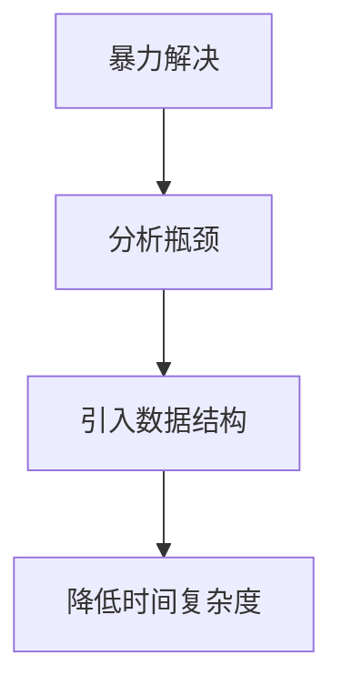

# LeetCode算法进阶之路：从数据机构到算法思想的刷题笔记


算法能力是编程人员成长过程中不可绕过的基础能力。在实际工程开发中，我们更多面对的是业务问题、系统设计、架构演进以及工程实践，但有很多底层能力。例如：如何高效处理数据、如何设计合理的数据结构、如何优化程序复杂度——最终都会回归到数据结构与算法。从日常开发中的缓存设计，到高性能系统中的数据组织、搜索优化，再到人工智能和计算机视觉领域中的模型设计，算法思想始终贯穿其中。

过去的开发经历让我积累了一定的工程经验，也意识到掌握语言特性和框架使用，并不能代表真正具备扎实的软件工程能力。因此，开始重新系统学习数据结构与算法，并通过[LeetCode](https://leetcode.com/)作为主要练习平台，将每一道题的思考过程、算法思想以及实现方式记录下来。这篇文章将作为我的LeetCode刷题总记录，持续更新，[Github](https://github.com/AndyFree96/leetcode-notebook)同步记录。

<!--more-->

## 刷题目标

刷LeetCode并不是为了简单追求题目数量，也不是为了机械记忆某些固定模板。真正希望通过刷题达到以下几个目标：

### 建立完整的数据结构知识体系

重新梳理常见的数据结构：

- 数组（Array）
- 链表（Linked List）
- 栈（Stack）
- 队列（Queue）
- 哈希表（Hash Table）
- 树（Tree）
- 图（Graph）
- 堆（Heap）

理解它们的内部结构、适用场景以及时间复杂度。

### 掌握常见算法思想

算法题真正考察的并不是代码，而是解决问题的思维方式。

刷题过程中重点总结：

- 双指针（Two Pointers）
- 滑动窗口（Sliding Window）
- 二分查找（Binary Search）
- 深度优先搜索（DFS）
- 广度优先搜索（BFS）
- 回溯（Backtracking）
- 动态规划（Dynamic Programming）
- 贪心算法（Greedy）
- 分治算法（Divide and Conquer）

希望逐渐形成面对陌生问题时的分析能力，而不是依赖题目记忆。

### 提升工程代码能力

算法题最终需要通过代码实现。在实现过程中，会持续关注：

- 代码可读性
- 边界条件处理
- 时间复杂度
- 空间复杂度
- 不同语言实现方式

目前主要使用：

- C++
- C#
- Python
- TypeScript

进行练习。通过不同语言实现同一个算法，也可以进一步理解语言特性以及底层实现差异。

<!-- ## 记录方式 -->

<!-- 本文不会简单罗列题目列表，而是按照知识体系进行整理。每一道题主要记录：

- 题目名称
- 题号
- 难度
- 涉及知识点
- 解题思路
- 核心算法
- 代码实现
- 时间复杂度
- 空间复杂度
- 个人总结 -->

## 刷题记录

后续章节将按照数据结构和算法分类持续更新。当前规划：

- 数组与字符串篇
- 链表篇
- 栈与队列篇
- 哈希表篇
- 二叉树篇
- DFS / BFS 篇
- 二分查找篇
- 动态规划篇
- 图论篇
- 高级数据结构篇

## 数组与字符串篇

### 两数之和

| 题号 | 难度 | 题目链接                                         | 标签         |
| :--- | :--- | :----------------------------------------------- | :----------- |
| #1   | Easy | [Two Sum](https://leetcode.com/problems/two-sum) | 数组、哈希表 |

#### 解题思路

##### 最直接的思路：暴力枚举

最容易想到的方法是遍历数组中的每两个元素：

```cpp
nums[i] + nums[j] == target
```

如果满足条件，就返回对应下标。这种方法简单，但需要两层循环。时间复杂度：$O\left(n^2\right)$。当数组规模较大时，性能较差。

##### 优化思路：利用哈希表较低查找复杂度

我们在寻找：

```cpp
nums[i] + nums[j] == target
```

可以转化为：

```cpp
nums[j] == target - nums[i]
```

也就是说遍历当前元素时，只需要判断之前是否出现过：target-当前值。

#### 算法流程

```
初始化HashMap
遍历数组:
  计算需要寻找的值: target - nums[i]
  如果HashMap中存在:
    返回对应下标
  否则:
    将当前元素加入HashMap
```

#### C++实现

```cpp
class Solution {
public:
    vector<int> twoSum(vector<int>& nums, int target) {
        unordered_map<int, int> hash;
        hash.reserve(nums.size());

        for (int i = 0; i < nums.size(); i++) {
            int complement = target - nums[i];

            auto it = hash.find(complement);

            if (it != hash.end()) {
                return {it->second, i};
            }

            hash[nums[i]] = i;
        }

        return {};
    }
};
```

#### C#实现

```c#
public class Solution {
    public int[] TwoSum(int[] nums, int target) {
        var map = new Dictionary<int, int>();
        for (int i = 0; i < nums.Length; i++) {
            int complement = target - nums[i];
            if (map.TryGetValue(complement, out int index)) {
                return new[] {index, i};
            }

            map[nums[i]] = i;
        }
        return Array.Empty<int>();
    }
}
```

#### Python实现

```python
class Solution:
    def twoSum(self, nums: List[int], target: int) -> List[int]:
        hashMap = {}
        for i, num in enumerate(nums):
            complement = target - num
            if complement in hashMap:
                return [hashMap[complement], i]
            hashMap[nums[i]] = i
        return []
```

#### TypeScript实现

```ts
function twoSum(nums: number[], target: number): number[] {
  const map = new Map<number, number>();
  for (let i = 0; i < nums.length; i++) {
    const complement = target - nums[i];
    if (map.has(complement)) {
      return [map.get(complement), i];
    }

    map.set(nums[i], i);
  }

  return [];
}
```

#### 复杂度

遍历数组一次$O\left(n\right)$，哈希表查询平均$O\left(1\right)$。因此，时间复杂度为$O\left(n\right)$。额外使用哈希标保存元素，空间复杂度为$O\left(n\right)$。

#### 知识总结

哈希表的核心价值是可以通过空间换时间，增加额外存储空间，将查找过程优化。这种思想在实际工程中非常常见。例如，使用HashSet数据去重，判断元素是否已经出现。Redis缓存查询，通过哈希结构快速定位数据。

#### 个人总结

两数之和是LeetCode中非常经典的一道入门题。它的重要意义并不在于题目本身，而是第一次体现了：

> 面对一个查找问题，不一定要直接搜索，可以通过合适的数据结构改变问题的复杂度。

后续很多算法优化，本质都是类似思想：



这是学习算法过程中非常重要的一种思维方式。

### 两个有序数组的中位数

| 题号 | 难度 | 题目链接                                                                                 | 标签                 |
| :--- | :--- | :--------------------------------------------------------------------------------------- | :------------------- |
| #4   | Hard | [Median of Two Sorted Arrays](https://leetcode.com/problems/median-of-two-sorted-arrays) | 二分查找、数组、分治 |

本题的最大难点是时间复杂度必须为$O\left( log\left( m + n \right) \right)$。

#### 解题思路

##### 方法1：直接合并

`i`指向`nums1`，`j`指向`nums2`，每次取较小元素。时间复杂度$O\left( m + n \right)$，空间复杂度$O\left ( m + n \right)$。虽然容易实现，但不满足题目要求。

## 链表篇

## 栈与队列篇

## 哈希表篇

## 二叉树篇

## DFS / BFS 篇

## 二分查找篇

## 动态规划篇

## 图论篇

## 高级数据结构篇

## 推荐

[leetcode-master](https://github.com/youngyangyang04/leetcode-master): 代码随想录》LeetCode 刷题攻略：200道经典题目刷题顺序，共60w字的详细图解，视频难点剖析，50余张思维导图，支持C++，Java，Python，Go，JavaScript等多语言版本，从此算法学习不再迷茫！🔥🔥 来看看，你会发现相见恨晚！🚀

## 参考

算法竞赛入门经典 第2版 (刘汝佳)

挑战程序设计竞赛 第2版 (秋叶拓哉)

---

> 作者: [AndyFree96](https://andyfree96.github.io/)  
> URL: http://localhost:1313/leetcode%E7%AE%97%E6%B3%95%E8%BF%9B%E9%98%B6%E4%B9%8B%E8%B7%AF/  

