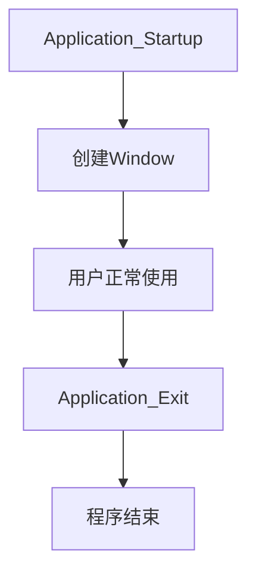
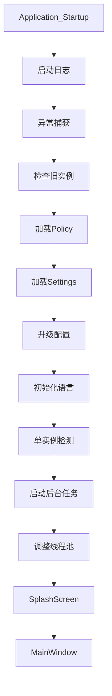

# NETworkManager源码剖析：一个网络管理工具的实现细节


在 GitHub 闲逛时，我偶然发现了[NETworkManager](https://borntoberoot.net/NETworkManager/)这个开源项目。作为一款网络管理和故障排查工具，它已经积累了超过 8.5k Star，足以说明社区对它的认可。更让我感兴趣的是，这个项目采用 C# + WPF 进行开发，与我当前正在深入学习和实践的技术栈高度契合。因此，我产生了一个想法：通过深入分析 NETworkManager 的源码，探索一个成熟的 WPF 桌面应用是如何进行架构设计、模块划分以及工程实践的。接下来，我将以 NETworkManager 为切入点，逐步拆解它在 WPF UI 设计、MVVM 架构、依赖注入、配置管理、网络通信、异步编程以及工程化实践 等方面的实现，希望能够从优秀的开源项目中学习桌面应用开发的最佳实践。
<!--more-->

```bash
git clone --recurse-submodules https://github.com/BornToBeRoot/NETworkManager.git
```

将项目Clone到本地，整个解决方案结构如下：


解决方案下包含了多个子项目，说明将实现逻辑进行了合理拆分，进行了模块化设计。

## 1. NETworkManager启动时，到底发生了什么？

WPF应用生命周期大致如下：



在Visual Studio 2026按F5调试启动后，首先映入眼帘的是启动画面窗口：


接着就会出现隐私政策设置界面：


点击“继续”后就进入到了主界面(仪表盘)：


NETworkManager项目的`App.xaml.cs`中包含了软件启动时的逻辑，里面主要包含了`Application_Startup`、`OnSessionEnding`、`Application_Exit`和`Save`等4个方法。

### Application_Startup

设置了全局异常捕获：

```c#
AppDomain.CurrentDomain.UnhandledException += (_, args) =>
{
    Log.Fatal("Unhandled exception occured!");

    Log.Fatal($"Exception raised by: {args.ExceptionObject}");
};
```

等待旧进程退出：

```c#
if (CommandLineManager.Current.RestartPid != -1)
{
    Log.Info(
        $"Waiting for another NETworkManager process with Pid {CommandLineManager.Current.RestartPid} to exit...");

    var processList = Process.GetProcesses();
    var process = processList.FirstOrDefault(x => x.Id == CommandLineManager.Current.RestartPid);
    process?.WaitForExit();

    Log.Info($"NETworkManager process with Pid {CommandLineManager.Current.RestartPid} has been exited.");
}
```

单实例检测：

```c#
_mutex = new Mutex(true, "{" + Guid + "}");
```

防止用户点击两次exe，两个程序运行。第一次创建`Mutex`成功，第二次创建`Mutex`失败。于是：

```c#
var mutexIsAcquired = _mutex.WaitOne(TimeSpan.Zero, true);

Log.Info($"Mutex value for {Guid} is {mutexIsAcquired}");

// Release mutex
if (mutexIsAcquired)
    _mutex.ReleaseMutex();

// If another instance is running, bring it to the foreground
if (!mutexIsAcquired && !SettingsManager.Current.Window_MultipleInstances)
{
    // Bring the already running application into the foreground
    Log.Info(
        "Another NETworkManager process is already running. Trying to bring the window to the foreground...");
    SingleInstance.PostMessage(SingleInstance.HWND_BROADCAST, SingleInstance.WM_SHOWME, IntPtr.Zero,
        IntPtr.Zero);

    // Close the application                
    _singleInstanceClose = true;
    Shutdown();

    return;
}

```

接下来会显示启动画面窗口和主窗口：

```c#
// Show splash screen
if (SettingsManager.Current.SplashScreen_Enabled)
{
    Log.Info("Show SplashScreen while application is loading...");
    new SplashScreen(@"SplashScreen.png").Show(true, true);
}

// Show main window
Log.Info("Set StartupUri to MainWindow.xaml...");
StartupUri = new Uri("MainWindow.xaml", UriKind.Relative);
```

启动流程如下：



`Policy`从exe所在目录的`config.json`加载，而LocalSettings从`用户家目录\\AppData\\Local\\NETworkManager\\Settings.json`文件加载，Settings从`用户家目录\\Documents\\NETworkManager\\Settings\\Settings.json`文件加载。

### Application_Exit

`Application_Exit`会在应用退出时调用，主要调用了`Save`，在退出时保存程序设置和配置文件。

### Save

`Save`如果检测到更改，会保存应用程序设置和配置文件数据。

### OnSessionEnding

`OnSessionEnding`会在Windows注销或者Windows关机时被调用。

## 2. 日志保存在什么位置？

NETworkerManager使用的是[log4net](https://logging.apache.org/log4net/index.html)日志库。在项目的根目录下有一个`log4net.config`文件用于配置日志：

```xml
<log4net>
    <root>
        <!-- Log level: ALL, DEBUG, INFO, WARN, ERROR, FATAL, OFF -->
        <level value="INFO"/>        
        <appender-ref ref="console"/>
        <appender-ref ref="file"/>
    </root>
    <appender name="console" type="log4net.Appender.ConsoleAppender">
        <layout type="log4net.Layout.PatternLayout">
            <conversionPattern value="%date [%thread] %-5level %logger - %message%newline"/>
        </layout>
    </appender>
    <appender name="file" type="log4net.Appender.RollingFileAppender">
        <file value="${LocalAppData}\\NETworkManager\NETworkManager.log"/>
        <appendToFile value="true"/>
        <rollingStyle value="Size"/>
        <maxSizeRollBackups value="5"/>
        <maximumFileSize value="10MB"/>
        <staticLogFileName value="true"/>
        <layout type="log4net.Layout.PatternLayout">
            <conversionPattern value="%date [%thread] %-5level %logger - %message%newline"/>
        </layout>
    </appender>
</log4net>
```

日志保存在`${LocalAppData}\\NETworkManager`目录中。

## 3. 仪表盘界面中的IP地址是如何获取的？

如4所示，仪表盘界面中的IPv4、IPv6以及DNS地址是如何获取的呢？`ViewModels/NetworkConnectionWidgetViewModel.cs`可以找到答案。


---

> 作者: [AndyFree96](https://andyfree96.github.io/)  
> URL: http://localhost:1313/networkmanager%E6%BA%90%E7%A0%81%E5%89%96%E6%9E%90/  

