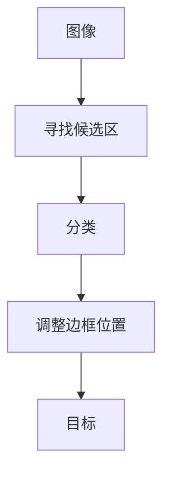
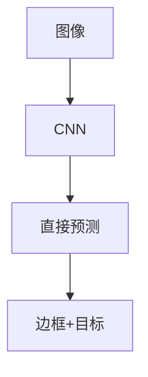

# YOLOv1论文精读：You Only Look Once如何重新定义目标检测？


> 论文：You Only Look Once: Unified, Real-Time Object Detection
>
> 作者：Joseph Redmon, Santosh Divvala, Ross Girshick, Ali Farhadi
>
> 论文地址：[https://arxiv.org/pdf/1506.02640](https://arxiv.org/pdf/1506.02640)

<!--more-->

## 1. 背景

目标检测(Object Detection)一直是计算机视觉领域最重要的任务之一。与图像分类不同，目标检测不仅需要回答**图像中是什么**？还需要回答**目标在哪里**？因此目标检测同时完成两个任务：

- 分类(Classification)
- 定位(Localization)

例如输入一张街景图：


模型需要输出：

```
Object:
  Class: car
  Bounding Box:
    x
    y
    width
    height
```

在YOLOv1提出之前，一些方法比如R-CNN[^1]会先在图像中找到Bounding Boxes，然后对这些Bounding Boxes在分类器上进行分类。之后会优化Bounding Boxes，消除重复的检测结果，并对Bounding Boxes重新评估打分。


这种方法流程很复杂，由于各个组件都要单独训练，导致非常难优化。

## 2. 论文核心思想

## 回归思想

传统目标检测方法流程如下：



YOLOv1流程如下：



++YOLOv1将目标检测视为一个回归问题，直接从原始图像输出边框和类概率++。只需要看一次图像，就可以预测是什么物体以及它在哪里[^2]。


### Grid Cell思想

将输入图片划分为多个Grid Cell，每个Grid Cell负责检测：目标中心点落在该区域的目标。


每个Grid Cell预测$Pr\left(Class_i | Object \right)$。

### Bounding Box预测

每个Grid Cell预测$B$个Bounding Box，每个Bounding Box包含$\left(x, y, w, h,  confidence \right)$。其中$x, y$表示目标中心点相对于Grid Cell的位置。$w, h$表示目标宽和高。$confidence$表示$Pr\left( Object\right) \times IOU^{truth}_{pred}$。


## 3. 网络结构

YOLOv1主要由24个卷积层和2个全连接层组成[^2]：


输入$448 \times 448 \times 3$，输出$7 \times 7 \times * 30$。

## 4. Loss函数


$$
\begin{aligned}
\mathcal{L}_\text{loc} &= \lambda_\text{coord} \sum_{i=0}^{S^2} \sum_{j=0}^B \mathbb{1}_{ij}^\text{obj} [(x_i - \hat{x}_i)^2 + (y_i - \hat{y}_i)^2 + (\sqrt{w_i} - \sqrt{\hat{w}_i})^2 + (\sqrt{h_i} - \sqrt{\hat{h}_i})^2 ] \\
\mathcal{L}_\text{cls}  &= \sum_{i=0}^{S^2} \sum_{j=0}^B \big( \mathbb{1}_{ij}^\text{obj} + \lambda_\text{noobj} (1 - \mathbb{1}_{ij}^\text{obj})\big) (C_{i} - \hat{C}_{i})^2 + \sum_{i=0}^{S^2} \sum_{c \in \mathcal{C}} \mathbb{1}_i^\text{obj} (p_i(c) - \hat{p}_i(c))^2\\
\mathcal{L} &= \mathcal{L}_\text{loc} + \mathcal{L}_\text{cls}
\end{aligned}
$$

其中：

- $\mathbb{1}_{i}^\text{obj}$：第$i$个Grid Cell是否包含对象
- $\mathbb{1}_{ij}^\text{obj}$：它指示第$i$个Grid Cell的第$j$个Bounding Box是否“负责”该对象的预测
- $C_{i}$：第$i$个Grid Cell的$confidence$
- $\hat{C}_{i}$：第$i$个Grid Cell预测的$confidence$
- $\mathcal{C}$：有多少个类
- $p_i(c)$：第$i$个Grid Cell包含$c$类对象的条件概率
- $\hat{p}_i(c)$：第$i$个Grid Cell预测为$c$类对象的条件概率

## 5. 训练过程

作者在 PASCAL VOC 2007 和 PASCAL VOC 2012 的训练集与验证集上，对网络进行了约 135 个 Epoch 的训练。当测试 VOC 2012 数据集时，还将 VOC 2007 的测试集 一并加入训练数据中。

整个训练过程中采用以下超参数：

- Batch Size：64
- Momentum：0.9
- Weight Decay：0.0005

学习率（Learning Rate）采用分阶段调整策略：

1. 训练初期，将学习率从 1×10⁻³ 缓慢提升到 1×10⁻²（Warm-up）。如果一开始就使用较大的学习率，模型通常会因为梯度不稳定（unstable gradients）而发生训练发散（diverge）。
2. 使用 1×10⁻² 继续训练 75 个 Epoch。
3. 将学习率降低至 1×10⁻³，训练 30 个 Epoch。
4. 最后将学习率进一步降低至 1×10⁻⁴，再训练 30 个 Epoch。

为了减少过拟合（Overfitting），作者采用了 Dropout 和大量的数据增强（Data Augmentation）。

其中：

- 在第一个全连接层（Fully Connected Layer）之后加入一个 Dropout 层，其丢弃率（Dropout Rate）为 0.5。
  Dropout 的作用是防止各层神经元之间产生协同适应（Co-adaptation），提高模型的泛化能力。

数据增强方面，主要包括：

- 对输入图像进行随机缩放（Random Scaling）和随机平移（Random Translation），变化幅度最高可达到原始图像尺寸的 20%。
- 在 HSV（Hue、Saturation、Value）颜色空间中，对图像进行随机颜色扰动。

## 6. 推理过程

YOLOv1 在推理阶段仅需一次前向传播即可同时完成目标定位与分类，在 VOC 上输出 98 个候选框。由于大目标或跨网格目标可能产生重复检测，作者采用 NMS 去除冗余框，从而进一步提升约 2–3% 的 mAP，同时几乎不影响其高速检测特性。

## 7. 源码实现

可参考[Yolov1-PyTorch](https://github.com/explainingai-code/Yolov1-PyTorch)实现。


{}

```py

```

{}
{}

```py

```

{}


## 8. 总结

YOLOV1最重要的三个思想是：

1. **把目标检测统一成一个回归问题**：直接从整张图预测Bounding Boxes和类别，而不是先生成候选框再分类。
2. **整张图划分为Grid Cell**：目标中心落在哪个网格，哪个网格就负责预测该目标。
3. **一次前向传播完成预测**：网络一次输出所有预测框和类别，再通过NMS得到最终结果，因此速度远远快于当时的两阶段检测器。

## 9. 推荐

[Concept of YOLOv1:The Evolution of Real-Time Object Detection](https://medium.com/@sachinsoni600517/concept-of-yolov1-the-evolution-of-real-time-object-detection-d773770ef773)

[YOLOv1 Paper Walkthrough: The Day YOLO First Saw the World](https://towardsdatascience.com/yolov1-paper-walkthrough-the-day-yolo-first-saw-the-world/)

[【精读AI论文】YOLO V1目标检测，看我就够了](https://www.bilibili.com/video/BV15w411Z7LG)

[YOLO Object Detection | YoloV1 Explanation and Implementation Tutorial](https://www.youtube.com/watch?v=TPD9AfY7AHo)

[^1]: [Rich feature hierarchies for accurate object detection and semantic segmentation](https://openaccess.thecvf.com/content_cvpr_2014/papers/Girshick_Rich_Feature_Hierarchies_2014_CVPR_paper.pdf)

[^2]: [You Only Look Once: Unified, Real-Time Object Detection](https://arxiv.org/pdf/1506.02640)


---

> 作者: [AndyFree96](https://andyfree96.github.io/)  
> URL: http://localhost:1313/yolov1%E8%AE%BA%E6%96%87%E7%B2%BE%E8%AF%BB/  

