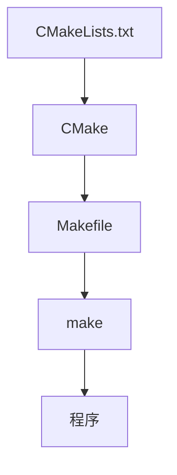
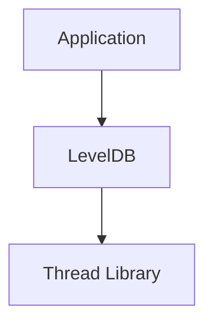

# 从LevelDB CMakeFiles.txt开始学习CMake：C++项目构建系统入门


最近开始阅读[LevelDB](leveldb源码剖析/)源码，希望通过源码理解一个优秀 C++ 项目的工程设计。当我打开LevelDB项目目录时，发现CMakeLists.txt几乎贯穿整个项目，但是我之前并没有怎么使用过CMake。CMakeLists.txt的内容让我有点无法理解。于是产生了几个问题：

- CMake是什么？
- 为什么C++项目需要CMake？
- CMake和Make有什么区别？
- CMakeLists.txt如何组织一个大型项目？

带着这些问题，开始学习CMake。
<!--more-->

## C++项目为什么需要构建系统？

假设我们有一个`main.cpp`文件：

```cpp
#include <iostream>

int main()
{
    std::cout<<"Hello";
}
```

编译：

```bash
g++ main.cpp -o app
```

非常简单。但随着项目变大，源码可能牵涉几十个甚至几百个文件。此时，如果再使用：

```bash
g++ xxx.cc xxy.cc xxz.cc
```

就不太方便且不可维护，最好能自动管理编译过程。

## Make是什么？

最早出现的是Make。Make通过Makefile描述如何编译、文件依赖、编译顺序。例如：

```makefile
app:
  g++ main.cpp math.cpp -o app
```

执行：

```bash
make
```

就会生成可执行文件`app`。

Make解决了哪些文件需要重新编译的问题，假如我们只修改了`math.cpp`就只要重新编译`math.cpp`，而不是全部重新编译。

## 为什么不用Make？

不同平台我们使用的编译器可能不一样，比如在Linux下我们用的是gcc，Windows下用的是cl.exe，macOS下用的是clang，这就导致我们需要维护多个Makefile。

另外，项目可能有非常多的第三方依赖，手写非常麻烦。


## CMake是什么？

CMake是生成构建文件的工具。



CMake不负责编译，真正编译的是gcc/clang/cl.exe。

## 第一个CMake项目

创建：



- name: HelloCMake
  type: dir
  children:
  - name: CMakeLists.txt
    type: file
  - name: main.cpp
    

`main.cpp`:

```cpp
#include <iostream>

int main() {
    std::cout << "Hello CMake" << std::endl;
    return 0;
}
```

CMakeLists.txt：

```cmake
cmake_minimum_required(VERSION 3.10)

project(HelloCMake)

add_executable(
    hello
    main.cpp
)
```

构建：

```bash
mkdir build
cd build
cmake ..
cmake --bulid .
```

生成了hello.exe。

## 理解CMake核心概念

### Target

开始阅读LevelDB CMakeLists.txt时，最重要的概念是++Target++。CMake并不是告诉编译器执行哪些命令，而是描述项目有哪些构建目标，以及目标之间如何依赖。

例如：

```cmake
add_library(leveldb)
```

创建了一个Target `leveldb`，它不是`leveldb.cpp`也不是leveldb文件夹，而是一个逻辑对象。这个Target可以有源文件、头文件路径、编译参数、链接依赖。最终生成leveldb.lib(Windows)或libleveldb.a(Linux)。

### add_library

在LevelDB中：

```cmake
add_library(leveldb ")
```

表示创建一个名为leveldb的库目标。后续：

```cmake
target_sources(
    leveldb
    PRIVATE
    ${LEVELDB_SOURCES}
)
```

给它添加源码。

### target_include_directories

`target_include_directories`告诉CMake头文件在哪里。

```cmake
target_include_directories(leveldb
  PUBLIC
    $<BUILD_INTERFACE:${PROJECT_SOURCE_DIR}/include>
    $<INSTALL_INTERFACE:${CMAKE_INSTALL_INCLUDEDIR}>
)
```

### target_link_libraries

一个库通常不会孤立存在，`target_link_libraries`描述了模块之间如何链接。

例如：

```cmake
target_link_libraries(leveldb Threads::Threads)
```

表明LevelDB使用线程库。

### PRIVATE和PUBLIC



Application是否需要Thread Library？由关键字决定。

PRIVATE表示只属于当前Target，也就是Application不知道Thread Library。

PUBLIC表示自己需要，同时暴露给使用者。

例如：

```cmake
target_include_directories(
    leveldb
    PUBLIC
    include
)
```

表示使用LevelDB的程序，也需要这个头文件目录。

### find_package

大型项目不会写`C:\xxx\pthread.lib`, 而是：

```cmake
find_package(Threads REQUIRED)
```

让CMake自动寻找，成功后`Threads::Threads`就是一个Target。

然后：

```cmake
target_link_libraries(
    leveldb
    Threads::Threads
)
```

### add_subdirectory

大型项目通常每个模块都有自己的CMakeLists.txt，主文件`add_subdirectory`表示继续处理子模块。

例如：

```cmake
add_subdirectory("third_party/googletest")
```

## 推荐

[CMake Tutorial](https://cmake.org/cmake/help/latest/guide/tutorial/index.html)

[Learn Makefiles With the tastiest examples](https://makefiletutorial.com/)

[CMake: The Comprehensive Guide to Managing and Building C++ Projects (From Basics to Mastery)](https://simplifycpp.org/books/CMake.pdf)

[Modern CMake for C++: Effortlessly build cutting-edge C++ code and deliver high-quality solutions , Second Edition](https://www.packtpub.com/en-us/product/modern-cmake-for-c-9781805123361)

[Professional CMake: A Practical Guide](https://crascit.com/professional-cmake/)


---

> 作者: [AndyFree96](https://andyfree96.github.io/)  
> URL: http://localhost:1313/%E4%BB%8Eleveldb%E5%BC%80%E5%A7%8B%E5%AD%A6%E4%B9%A0cmake/  

