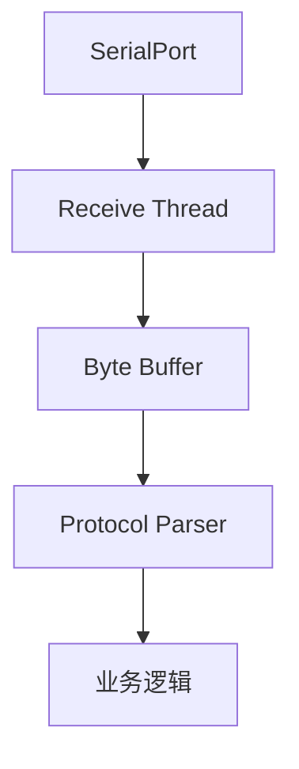

# C#编程实践(二)：从SerialPort到工业级通信框架设计


在现代工业化设备中，串口通信大量存在。例如：PLC通信、伺服驱动器、扫码枪、光源控制器、温控器等等。虽然现在Ethernet、TCP/IP越来越普及，但串口因为成本低、稳定、硬件简单等原因，仍然是工业现场最常见的通信方式之一。很多开发者初次接触串口通信，会觉得非常简单：

```c#
SerialPort serialPort = new();

serialPort.PortName = "COM3";
serialPort.BaudRate = 9600;

serialPort.Open();

serialPort.Write("Hello");
```

但是在实际工业项目中，很快会遇到为什么收到的数据经常不完整？为什么一次Read读不到完整协议？如何设计一个可扩展通信系统？真正困难的不是打开串口，而是：

> 如何设计一个可靠的串口通信系统。

<!--more-->

## 串口通信是什么？

串口(Serial Port)是一种按照++一个bit一个bit顺序传输数据++的通信方式。例如：`01010101`，不是一次性发送8个bit，而是`bit0` -> `bit1` -> ... -> `bit7`。

与并口(Parallel Port)相比：

|      | 串口 | 并口   |
| :---- | :-- | :---- |
| 传输方式 | 逐位 | 多位同时 |
| 线路   | 少  | 多    |
| 距离   | 远  | 短    |
| 成本   | 低  | 高    |


## RS232/RS485/TTL有什么区别？


## C#中SerialPort的基本使用

.NET提供[System.IO.Ports.SerialPort](https://learn.microsoft.com/en-us/dotnet/api/system.io.ports.serialport)，可如下创建一个实例：

```c#
var port = new SerialPort
{
    PortName="COM3",
    BaudRate=9600,
    DataBits=8,
    StopBits=StopBits.One,
    Parity=Parity.None
};
```

对应串口参数：

| 参数       | 含义  |
| :-------- | :--- |
| BaudRate | 波特率 |
| DataBits | 数据位 |
| StopBits | 停止位 |
| Parity   | 校验  |

## 为什么SerialPort.ReadLine很危险？

我们可能会这样写：

```c#
string data = serialPort.ReadLine();
```

问题是++串口没有天然消息边界++。例如：设备发送`AA 01 02 03 BB`，`SerialPort`第一次可能收到`AA 01`，第二次收到`02 03 BB`。串口只保证字节顺序，不保证一次读取就是一次发送。

## 串口通信核心问题：如何解决数据边界？

这是串口开发最重要的问题。

### 方案1：固定长度协议

假设协议结构如下，总共16字节。

```
+------+-----+-------+-----+
| HEAD | ADR | DATA  | CRC |
+------+-----+-------+-----+
```

那么只要接收到了16字节去解析处理即可：

```c#
while(buffer.Count>=16)
{
    Parse(buffer.Take(16));
}
```

### 方案2：特殊字符分隔

例如`$TEMP,25.6#`，协议以`$`开始，以`#`结束。那么只要接收到了`#`就可以对该包进行解析：

```c#
if (byte == '#') {
  Parse(packet);
}
```

### 方案3：长度字段

协议中可增加一个长度字段：

```
+------+-----+-------+-----+
| HEAD | LEN | DATA  | CRC |
+------+-----+-------+-----+
```

解析：

```c#
if (buffer.Length >= len) {
  Parse();
}
```

## 正确的串口接收架构

不要`DataRecevied`->直接解析。推荐：



分为通信层、协议层、业务层。

## 实现一个工业级串口通信框架

创建项目：

```bash
dotnet new classlib -n SimpleSerialCommunication.Core
dotnet new console -n SimpleSerialCommunication.Sample --use-program-main
dotnet new sln -n SimpleSerialCommunication
dotnet sln add ./SimpleSerialCommunication.Core/SimpleSerialCommunication.Core.csproj
dotnet sln add ./SimpleSerialCommunication.Sample/SimpleSerialCommunication.Sample.csproj
```

`SimpleSerialCommunication.Core`需要引用`System.IO.Ports`。如果.NET Core/.NET 5+：

```bash
dotnet add package System.IO.Ports 
```

`SimpleSerialCommunication.Core`完整代码如下：


{}

```c#
using System;
using System.Collections.Generic;
using System.Linq;
using System.Text;
using System.Threading.Tasks;

namespace SimpleSerialCommunication.Core;

public class Packet
{
    public byte Command { get; init; }


    public byte[] Data { get; init; } = [];

    public override string ToString()
    {

        return $"CMD={Command:X2}, DATA={BitConverter.ToString(Data)}";
    }
}

```

{}
{}

```c#
using System;
using System.Collections.Generic;
using System.Linq;
using System.Text;
using System.Threading.Tasks;

namespace SimpleSerialCommunication.Core;

// CRC16-MODBUS
public static class CRC16
{
    public static ushort Calculate(byte[] data)
    {
        ushort crc = 0xFFFF;
        foreach (byte b in data)
        {
            crc ^= b;
            for (int i = 0; i < 8; i++)
            {
                if ((crc & 1) == 1)
                {
                    crc >>= 1;

                    crc ^= 0xA001;
                }
                else
                {
                    crc >>= 1;
                }
            }
        }
        return crc;
    }
}

```

{}

{}

```c#
using System;
using System.Collections.Generic;
using System.Linq;
using System.Text;
using System.Threading.Tasks;
using static System.Runtime.InteropServices.JavaScript.JSType;

namespace SimpleSerialCommunication.Core;

public class PacketBuilder
{
    private const byte HEADER = 0xAA;
    private byte _command;
    private byte[] _data = [];

    public static PacketBuilder Create()
    {
        return new();
    }

    public PacketBuilder Command(byte command)
    {
        _command = command;
        return this;
    }

    public PacketBuilder Data(byte[] value)
    {
        _data = value;
        return this;
    }

    public byte[] Build()
    {
        var buffer = new List<byte>
        {
            HEADER,
            (byte)_data.Length,
            _command
        };

        buffer.AddRange(_data);
        ushort crc = CRC16.Calculate([.. buffer]);
        buffer.Add((byte)(crc & 0xff));
        buffer.Add((byte)(crc >> 8));

        return [.. buffer];
    }

    public static byte[] Build(byte command, byte[] data)
    {
        var buffer = new List<byte>
        {
            HEADER,
            (byte)data.Length,
            command
        };

        buffer.AddRange(data);

        ushort crc = CRC16.Calculate([.. buffer]);
        buffer.Add((byte)(crc & 0xff));
        buffer.Add((byte)(crc >> 8));

        return [.. buffer];
    }


}

```

{}

{}
```c#
using System;
using System.Collections.Generic;
using System.Linq;
using System.Text;
using System.Threading.Tasks;

namespace SimpleSerialCommunication.Core;

public class PacketParser
{
    private const byte HEADER = 0xAA;

    private readonly SerialBuffer _buffer = new();

    public event EventHandler<Packet>? PacketReceived;

    public void Append(byte[] data)
    {
        _buffer.Append(data);

        Parse();
    }

    private void Parse()
    {
        while (true)
        {
            if (_buffer.Length < 2) return;

            // 寻找帧头
            if (_buffer.Get(0) != HEADER)
            {
                _buffer.Remove(1);
                continue;
            }


            // 协议帧格式: AA LEN CMD DATA CRC_L CRC_H
            byte length = _buffer.Get(1);
            int frameLength = 1 + 1 + 1 + length + 2;

            // 等待完整数据
            if (_buffer.Length < frameLength) return;

            byte[] frame = _buffer.Read(frameLength);

            ushort receiveCRC = BitConverter.ToUInt16(frame, frame.Length - 2);

            ushort calcCRC = CRC16.Calculate([.. frame.Take(frame.Length - 2)]);

            if (receiveCRC != calcCRC) {
                continue;
            }

            Packet packet = new Packet
            {
                Command = frame[2],
                Data = [.. frame.Skip(3).Take(length)],
            };

            PacketReceived?.Invoke(this, packet);
        }
    }
}

```
{}


{}

```c#
using System;
using System.Collections.Generic;
using System.Linq;
using System.Text;
using System.Threading.Tasks;

namespace SimpleSerialCommunication.Core;

public class SerialBuffer
{
    private readonly List<byte> _buffer = [];
    public int Length => _buffer.Count;

    public void Append(byte[] data)
    {
        _buffer.AddRange(data);
    }

    public byte Get(int index) => _buffer[index];

    public byte[] Read(int count)
    {
        var bufferSegment = _buffer.Take(count).ToArray();
        _buffer.RemoveRange(0, count);
        return bufferSegment;
    }

    public void Remove(int count)
    {
        _buffer.RemoveRange(0, count);
    }
}

```

{}


{}

```c#
using System;
using System.Collections.Generic;
using System.IO.Ports;
using System.Linq;
using System.Text;
using System.Threading.Tasks;

namespace SimpleSerialCommunication.Core;

public class SerialClient : IDisposable
{

    private readonly SerialPort _port;
    private readonly PacketParser _parser = new();

    public bool IsOpen => _port.IsOpen;

    public event EventHandler<Packet>? PacketReceived;

    public SerialClient(SerialOptions options)
    {
        _port = new SerialPort
        {
            PortName = options.PortName,
            BaudRate = options.BaudRate,
            Parity = options.Parity,
            DataBits = options.DataBits,
            StopBits = options.StopBits,
        };

        _port.DataReceived += OnDataReceived;
        _parser.PacketReceived += (_, packet) =>
        {
            PacketReceived?.Invoke(this, packet);
        };
    }
    public void Open()
    {
        if (!_port.IsOpen)
        {
            _port.Open();
        }
    }
    public void Close()
    {
        if (_port.IsOpen)
        {
            _port.Close();
        }
    }

    public void Dispose()
    {
        Close();
        _port.Dispose();
    }

    public void Send(byte command, byte[] data)
    {
        byte[] frame = PacketBuilder.Build(command, data);
        Send(frame);
    }

    public void Send(byte[] frame)
    {
        _port.Write(frame, 0, frame.Length);
    }

    private void OnDataReceived(object sender, SerialDataReceivedEventArgs e)
    {

        int count = _port.BytesToRead;

        byte[] buffer = new byte[count];


        _port.Read(
            buffer,
            0,
            count);


        _parser.Append(
            buffer);

    }
}

```

{}


{}

```c#
using System.IO.Ports;

namespace SimpleSerialCommunication.Core;

public class SerialOptions
{
    public string PortName { get; set; } = "COM1";
    public int BaudRate { get; set; } = 9600;
    public Parity Parity { get; set; } = Parity.None;
    public int DataBits { get; set; } = 8;
    public StopBits StopBits { get; set; } = StopBits.One;
}

```

{}



## 使用示例

```c# {title="SimpleSerialCommunication.Sample/Program.cs"}
using SimpleSerialCommunication.Core;

namespace SimpleSerialCommunication.Sample;

internal class Program
{
    static void Main(string[] args)
    {
        var client = new SerialClient(new SerialOptions()
        {
            PortName = "COM1",
            BaudRate = 9600
        });

        client.PacketReceived += (_, packet) =>
        {
            Console.WriteLine($"收到: {packet}");
        };

        client.Open();

        Console.WriteLine($"串口已打开");

        client.Send(0x10, []);
        client.Send(PacketBuilder.Create().Data([]).Command(0x10).Build());

        Console.ReadLine();

        client.Close();
    }
}
```

## 第三方库

[RJCP.SerialPortStream](https://www.nuget.org/packages/RJCP.SerialPortStream/): erialPortStream is an independent implementation of System.IO.Ports.SerialPort and SerialStream for better reliability and maintainability.

## 推荐

[TTL vs RS232 vs RS485: Choosing the Right Communication Standard for SHM](https://blog.quakelogic.net/ttl-vs-rs232-vs-rs485-choosing-the-right-communication-standard-for-shm/)

## 参考

[TTL、RS232、RS485串口通信协议详解与对比](https://xiaobite.blog.csdn.net/article/details/155668010)

---

> 作者: [AndyFree96](https://andyfree96.github.io/)  
> URL: http://localhost:1313/%E4%BB%8Eserialport%E5%88%B0%E5%B7%A5%E4%B8%9A%E7%BA%A7%E9%80%9A%E4%BF%A1%E6%A1%86%E6%9E%B6%E8%AE%BE%E8%AE%A1/  

