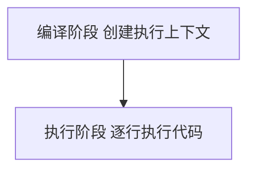
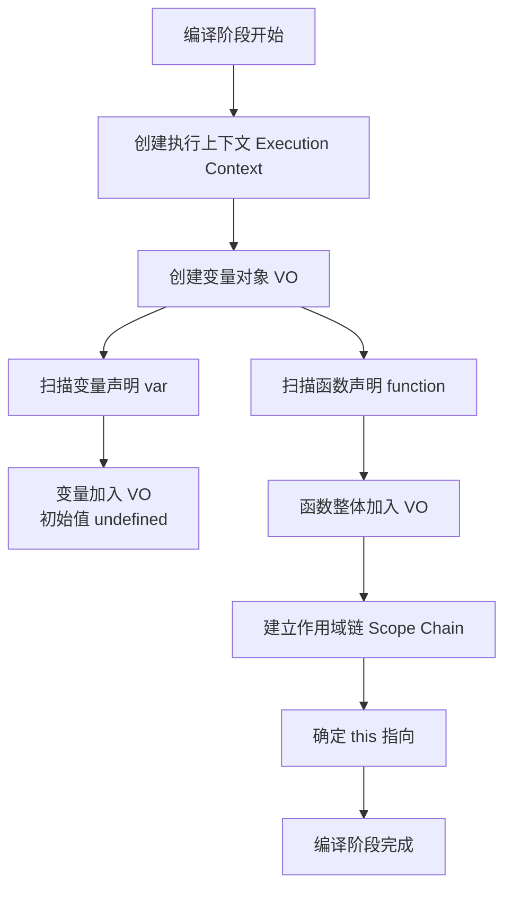
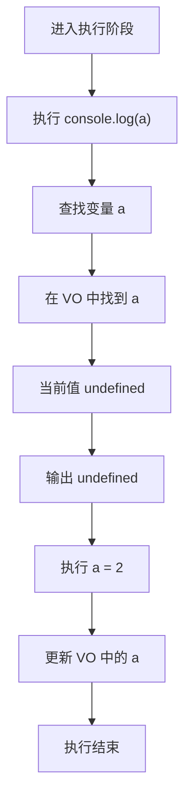
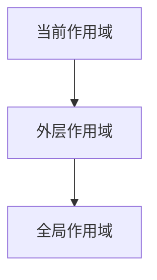

# 从执行上下文理解JavaScript变量提升


在学习 JavaScript 的过程中，我们可能会遇到一个经典问题：

```js
var a = 1;

function test() {
  console.log(a);
  var a = 2;
}

test();
```

<!--more-->

很多人第一反应是：

```bash
1
```

但实际运行结果却是：

```bash
undefined
```

为什么会出现这种情况？

理解这个问题的关键在于 JavaScript 的 **执行上下文（Execution Context）** 和 **变量提升（Hoisting）** 机制。

## JavaScript 是如何执行代码的

JavaScript 代码并不是从上到下一行一行直接执行的，而是大致分为两个阶段：



在编译阶段，JavaScript 引擎会：

1. 创建执行上下文
2. 创建变量对象 VO
3. 扫描`var`
4. 扫描`function`
5. 建立作用域链
6. 确定`this`



示例：

```js
function test() {
  console.log(a);
  var a = 2;
}
```

编译阶段后：

```js
VO = {
  a: undefined,
};
```

在编译阶段会发生变量提升（Hoisting）。主流浏览器和 Node.js 使用的 JavaScript 引擎是[V8](https://v8.dev/)。

## 什么是执行上下文 (Execution Context)

简单的一句话总结：执行上下文 = JavaScript 代码执行时的环境。

它决定了代码在运行时 变量如何查找、函数如何调用、this 指向什么。

JavaScript 中有三种执行上下文：全局执行上下文（Global Execution Context）、函数执行上下文（Function Execution Context）和`eval`执行上下文。

## 执行上下文的结构

每个执行上下文内部通常包含三个核心部分：

```bash
ExecutionContext
│
├── LexicalEnvironment
├── VariableEnvironment
└── ThisBinding
```

其中最重要的是`LexicalEnvironment`。它内部包含：`EnvironmentRecord`用于存储变量：

```js
{
  a: 1,
  b: 2
}
```

## 变量提升是如何发生的

回到最开始的代码：

```js
var a = 1;

function test() {
  console.log(a);
  var a = 2;
}

test();
```

当`test()`被调用时，JavaScript 会创建新的执行上下文`test Execution Context`。

在编译阶段，引擎会扫描变量声明：

```js
var a;
```

并在环境记录中创建变量：

```
EnvironmentRecord

a: undefined
```

此时执行上下文变成：

```
est Execution Context

LexicalEnvironment
└── EnvironmentRecord
        a: undefined
```

## 代码真实执行顺序

执行阶段，JavaScript 会逐行执行代码：



## 为什么不是输出 1

代码中实际上存在两个`a`：

```js
var a = 1; // 全局变量

function test() {
  var a = 2; // 局部变量
}
```

JavaScript 查找变量遵循 **作用域链规则**：



当执行：

```js
console.log(a);
```

1. 先查找函数作用域
2. 找到了变量`a`
3. 但值是`undefined`
4. 因此不会再查找全局`a`

最终输出`undefined`。

## 如果使用 let 会发生什么

如果改成：

```js
var a = 1;

function test() {
  console.log(a);
  let a = 2;
}

test();
```

运行会报错：

```
ReferenceError: Cannot access 'a' before initialization
```

原因是`let`存在暂时性死区（Temporal Dead Zone，TDZ）。在`let`或`const`声明的变量 从作用域开始到变量声明之前的区域，在这段时间内访问变量会直接抛出 `ReferenceError`。**变量在声明之前不可访问。**

## 模拟 JavaScript 引擎编译

下面用 JavaScript 模拟一个简单的编译器行为：

```js
function compile(code) {
  // 执行上下文
  const executionContext = {
    VO: {}, // Variable Object
    scopeChain: [],
    this: globalThis,
  };

  // 模拟扫描代码
  const lines = code.split('\n');

  for (const line of lines) {
    // 发现 var 声明
    if (line.includes('var ')) {
      const name = line.match(/var\s+(\w+)/)[1];
      executionContext.VO[name] = undefined;
    }

    // 发现 function 声明
    if (line.includes('function ')) {
      const name = line.match(/function\s+(\w+)/)[1];
      executionContext.VO[name] = '[Function]';
    }
  }

  return executionContext;
}
```

测试编译：

```js
const code = `
function test(){
  console.log(a)
  var a = 2
}
`;

console.log(compile(code));
```

输出如下：


写一个简单的执行器：

```js
function execute(context) {
  console.log('执行 console.log(a)');
  console.log(context.VO.a);

  console.log('执行 a = 2');
  context.VO.a = 2;
}
```

执行：

```js
const context = compile(code);
execute(context);
```


## 总结

理解变量提升的关键是理解执行上下文的创建过程。

核心要点：

- JavaScript 代码执行前会创建执行上下文
- 在编译阶段会扫描变量声明
- `var`声明的变量会被初始化为 `undefined`
- 局部变量会遮蔽外部变量
- `let`和`const`存在暂时性死区


---

> 作者: [AndyFree96](https://andyfree96.github.io/)  
> URL: http://localhost:9613/%E4%BB%8E%E6%89%A7%E8%A1%8C%E4%B8%8A%E4%B8%8B%E6%96%87%E7%90%86%E8%A7%A3javascript%E5%8F%98%E9%87%8F%E6%8F%90%E5%8D%87/  

