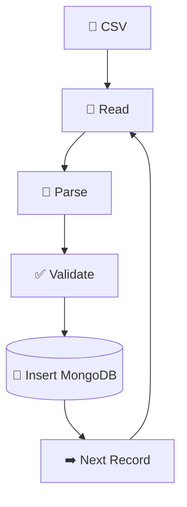
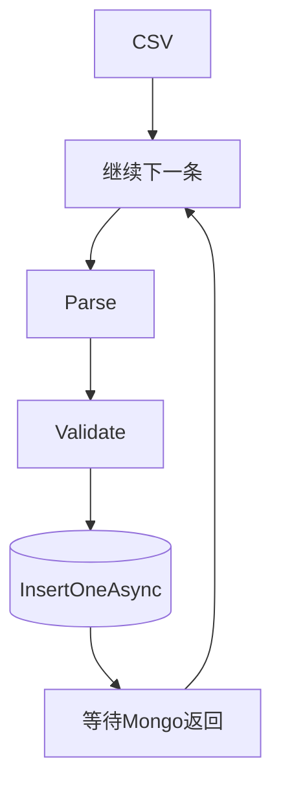
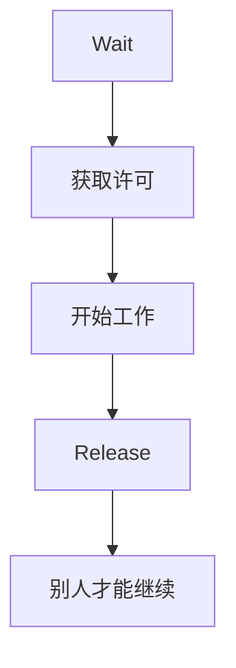
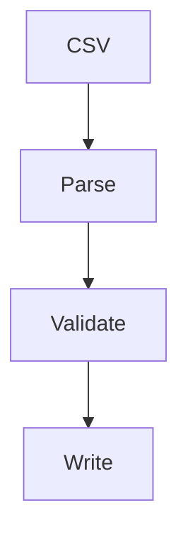

# 百万级CSV导入MongoDB性能实战


在日常开发中CSV导入是一个比较常见的数据处理场景。例如：

- 用户信息导入
- 商品数据同步
- 日志分析
- 财务流水导入

很多项目开始都会写出类似下面的代码：

```c#
foreach(var line in FileReadLines(path))
{
  var user = Parse(line);

  if (!Validate(user))
    continue;

    await collection.InsertOneAsync(user);
}
```

数据只有几千条时，这段代码运行地非常流畅。然而，当数据增长到几十万甚至几百万条之后，问题便开始暴露出来：

- CPU利用率很低
- MongoDB写入速度跟不上
- IO长时间阻塞
- GC次数明显增加
- 导入时间从几秒增长到数十分钟

<!--more-->

有些开发者的第一反应可能是：把`foreach`改成`Task.WhenAll`不就快了吗？于是写出了类似这样的代码：

```c#
await Task.WhenAll(File.ReadLines(path).Select(async line =>
{
    var user = Parse(line);

    if (Validate(user))
    {
        await collection.InsertOneAsync(user);
    }
}));
```

运行之后发现：

- CPU飙升
- 内存迅速上涨
- MongoDB开始拒绝连接
- 程序因为创建了大量Task而崩溃

那么问题来了：

> 如何高效地导入百万级CSV数据？

.NET提供了多种解决方案，每一种都有各自适用的场景，例如：

- 普通循环(Loop)
- `Task.WhenAll`
- `SemaphoreSlim`
- `Channel`

它们在代码负责度、吞吐量、内存占用以及可维护性等方面各有差异。本文将基于同一份100万行CSV数据，分别实现4种导入方案，并通过[BenchmarkDotNet](https://benchmarkdotnet.org/index.html)进行基准测试，从多个维度对它们进行比较。最终我们将回答以下问题：

- 哪种方案性能最好？
- 哪种方案内存占用最低？
- 哪种方案最容易维护？
- 什么场景应该选择哪种方案？

所有方案都使用同一套业务逻辑，包括：

1. 读取CSV文件
2. 解析数据
3. 校验字段
4. 写入MongoDB

确保对比结果具有可比性。

## 测试环境

本文测试环境如下：

| 项目      | 配置            |
| --------- | --------------- |
| .NET      | 10.0.301        |
| 操作系统  | Windows 11 25H2 |
| CPU       | i7-13700KF      |
| 内存      | 32 GB DDR5      |
| MongoDB   | 8.0.1           |
| Benchmark | BenchmarkDotNet |
| 数据量    | 1,000,000 行    |

如果你的硬件配置不同，最终耗时会有所差异，但4种方案之间相对性能趋势通常保持一致。

## 项目结构

我们将项目划分为多个模块：



- name: CsvImportBenchmark
  type: dir
  children:
  - name: Generator
    type: dir
    children:
    - name: CsvGenerator.cs
      type: file
  - name: Models
    type: dir
    children:
    - name: User.cs
      type: file
  - name: Parser
    type: dir
    children:
    - name: CsvParser.cs
      type: file
    - name: UserValidator.cs
      type: file
  - name: Mongo
    type: dir
    children:
    - name: MongoContext.cs
      type: file
    - name: UserRepository.cs
      type: file
  - name: Importers
    type: dir
    children:
    - name: LoopImporter.cs
      type: file
    - name: TaskWhenAllImporter.cs
      type: file
    - name: SemaphoreImporter.cs
      type: file
    - name: ChannelImporter.cs
      type: file
  - name: Benchmark
    type: dir
    children:
    - name: CsvImportBenchmark.cs
      type: file
- name: Program.cs
  type: file
  

这样每一种导入方式都只关注自己的实现，而解析、验证和数据库操作保持一致，避免重复代码。

## 创建项目

创建控制台项目：

```bash
mkdir CsvImportBenchmark
cd CsvImportBenchmark
dotnet new console -n CsvImportBenchmark --use-program-main
dotnet new sln -n CsvImportBenchmark
dotnet sln add ./CsvImportBenchmark/CsvImportBenchmark.csproj
```

安装需要的NuGet包：

```bash
cd CsvImportBenchmark
dotnet add package MongoDB.Driver
dotnet add package CsvHelper
dotnet add package Bogus
dotnet add package BenchmarkDotNet
```

## 数据模型

我们模拟一个用户表，字段尽量贴近真实业务。

```c#
public sealed class User
{
    [BsonId]
    [BsonGuidRepresentation(GuidRepresentation.Standard)]
    public Guid Id { get; set; }
    public string Name { get; set; } = "";
    public int Age { get; set; }
    public string Email { get; set; } = "";
    public string Phone { get; set; } = "";
    public DateTime Birthday { get; set; }
    public DateTime CreateTime { get; set; }
}

```

## CsvGenerator

创建`Generator/CsvGenerator.cs`，我们使用Bogus随机生成真实数据。

```c#
using Bogus;
using CsvHelper;
using CsvHelper.Configuration;
using CsvImportBenchmark.Models;
using System.Globalization;

namespace CsvImportBenchmark.Generator;

public static class CsvGenerator
{
    public static void Generate(string path, int count)
    {
        var faker = new Faker<User>()
            .RuleFor(x => x.Id, _ => Guid.NewGuid())
            .RuleFor(x => x.Name, f => f.Name.FullName())
            .RuleFor(x => x.Age, f => f.Random.Int(18, 70))
            .RuleFor(x => x.Email, f => f.Internet.Email())
            .RuleFor(x => x.Phone, f => f.Phone.PhoneNumber())
            .RuleFor(x => x.Birthday,
                f => f.Date.Past(40))
            .RuleFor(x => x.CreateTime,
                _ => DateTime.UtcNow);

        using var writer = new StreamWriter(path);

        using var csv = new CsvWriter(writer, new CsvConfiguration(CultureInfo.InvariantCulture));
        csv.WriteHeader<User>();

        csv.NextRecord();

        foreach(var user in faker.GenerateForever())
        {
            csv.WriteRecord(user);
            csv.NextRecord();
            count--;

            if (count == 0)
            {
                break;
            }
        }
    }
}

```

在`Program.cs`的`Main`方法中调用：

```c#
using CsvImportBenchmark.Generator;

namespace CsvImportBenchmark;

class Program
{
    static void Main(string[] args)
    {
        CsvGenerator.Generate("users.csv", 1_000_000);
    }
}
```

运行后生成users.csv，大约为130MB。


## MongoDB

启动MongoDB，创建数据库`csv-benchmark`以及Collection `users`。


为了公平测试，每次Benchmark前，将数据全部删除重新导入，否则索引缓存会影响结果。

## MongoContext

```c#
using CsvImportBenchmark.Models;
using MongoDB.Driver;

namespace CsvImportBenchmark.Mongo;

public sealed class MongoContext
{
    public IMongoCollection<User> Users { get; }

    public MongoContext()
    {
        var client = new MongoClient("mongodb://localhost:27017");
        var database = client.GetDatabase("csv-benchmark");
        Users = database.GetCollection<User>("users");
    }
}

```

这里只创建一个`MongoClient`，原因是它内部维护了连接池，应在整个应用生命周期内复用。不要在每次写入时都`new MongoClient()`，否则连接建立与释放会成为主要开销，Benchmark 结果也会失真。

## UserRepository

所有方案统一调用`UserRepository`。

```c#
using CsvImportBenchmark.Models;
using MongoDB.Driver;

namespace CsvImportBenchmark.Mongo;

public sealed class UserRepository
{
    private readonly IMongoCollection<User> _collection;

    public UserRepository(MongoContext context)
    {
        _collection = context.Users;
    }

    public Task InsertAsync(User user ) {
        return _collection.InsertOneAsync(user);
    }

    public Task InsertManyAsync(IReadOnlyCollection<User> users)
    {
        return _collection.InsertManyAsync(users);
    }

    public Task ClearAsync()
    {
        return _collection.DeleteManyAsync(_ => true);
    }
}

```

实际在生产环境中，大批量导入通常推荐使用`InsertManyAsync`或`BulkWriteAsync`，能够显著减少网络往返次数。本文以单条插入为主，是为了更直观比较不同方式本身。

## CsvParser

```c#
using CsvHelper;
using CsvHelper.Configuration;
using CsvImportBenchmark.Models;
using System.Globalization;

namespace CsvImportBenchmark.Parser;

public sealed class CsvParser
{
    public IEnumerable<User> Read(string path)
    {
        using var reader = new StreamReader(path);

        using var csv = new CsvReader(reader, new CsvConfiguration(CultureInfo.InvariantCulture));

        foreach(var item in csv.GetRecords<User>())
        {
            yield return item;
        }
    }
}

```

为什么使用`yield return`？

因为它有两个优势：

- 不需要一次性加载整个CSV到内存
- 可以边读边处理，适合百万级甚至更大的文件

如果改成`csv.GetRecords<User>().ToList()`，那么100万条记录会全部驻留在内存中，不仅增加GC压力，还会影响后续方案的真实性能。

## UserValidator

为了模拟真实业务，增加简单验证。

```c#
using CsvImportBenchmark.Models;

namespace CsvImportBenchmark.Parser;

public sealed class UserValidator
{
    public bool Validate(User user) {
        if (string.IsNullOrWhiteSpace(user.Name))
            return false;

        if (user.Age < 18)
            return false;

        if (string.IsNullOrWhiteSpace(user.Email))
            return false;

        return true;
    }
}

```

## Loop顺序导入——最简单也最稳定

现在开始实现第一种方案。

```c#
foreach (var user in parser.Read(path))
{
    if (!validator.Validate(user))
        continue;

    await repository.InsertAsync(user);
}
```

这是典型的顺序处理。整个流程如下：



整个过程中，同一时间只有一条记录在处理。它很简单，代码非常直观。即使一年以后回来维护，也能立即看懂。

### LoopImporter

创建`Importers/LoopImporter.cs`，完整代码如下：

```c#
using CsvImportBenchmark.Mongo;
using CsvImportBenchmark.Parser;

namespace CsvImportBenchmark.Importers;

public sealed class LoopImporter
{
    private readonly CsvParser _parser;
    private readonly UserValidator _validator;
    private readonly UserRepository _repository;

    public LoopImporter(CsvParser parser, UserValidator validator, UserRepository repository)
    {
        _parser = parser;
        _validator = validator;
        _repository = repository;
    }

    public async Task ImportAsync(string path)
    {
        foreach(var user in _parser.Read(path))
        {
            if (!_validator.Validate(user))
                continue;

            await _repository.InsertAsync(user);
        }
    }
}

```

注意这里没有`parser.Read(path).ToList()`，因为我们想边读边处理，而不是100万条数据全部加载到内存。

### 时间都花在哪里？



假设读取耗费0.1ms，解析耗费0.05ms，验证耗费0.02ms，Mongo耗费4ms。那么CPU真正工作时间0.17ms，等待4ms。CPU利用率不到5%，所以Loop的性能瓶颈是IO。Loo的优点是内存非常稳定，数据量增加内存也不会有太大的变化。

### 编写第1个Benchmark

先创建最简单的基准测试：

```c#
using BenchmarkDotNet.Attributes;
using CsvImportBenchmark.Importers;
using CsvImportBenchmark.Mongo;
using CsvImportBenchmark.Parser;

namespace CsvImportBenchmark.Benchmark;

[MemoryDiagnoser]
public class CsvImportBenchmark
{
    private readonly LoopImporter _loopImporter;
    private readonly UserRepository _repository;
    private const string CsvPath = "users.csv";

    public CsvImportBenchmark()
    {
        var parser = new CsvParser();
        var validator = new UserValidator();
        var context = new MongoContext();

        _repository = new UserRepository(context);
        _loopImporter = new LoopImporter(parser, validator, _repository);
    }

    [IterationSetup]
    public void Setup()
    {
        _repository.ClearAsync().GetAwaiter().GetResult();
    }

    [Benchmark(Baseline = true)]
    public async Task Loop()
    {
        await _loopImporter.ImportAsync(CsvPath);
    }
}

```

这里有几个关键点：

- 使用`[MemoryDiagnoser]`记录内存分配和 GC 情况。
- 使用`[IterationSetup]`在每次迭代前清空 MongoDB，避免缓存影响结果。将`Loop`标记为`Baseline`，后续所有方案都会以它作为对照。

### Loop的优缺点

| 优点         | 缺点                   |
| ------------ | ---------------------- |
| 代码最简单   | 吞吐量最低             |
| 几乎没有 Bug | CPU 利用率低           |
| 内存占用最小 | 无法利用多核           |
| 调试容易     | IO 等待时间长          |
| 易于维护     | 导入百万级数据耗时明显 |

Loop代码简单、容易维护，但它无法充分利用多核CPU和异步IO的能力。

## Task.WhenAll——性能提升还是内存灾难？

既然Loop方案只有1个任务在工作，CPU大部分时间都在等待IO。于是可能会想到把所有`Insert`一起执行，听起来似乎很合理。于是可能会写出这样的代码：

```c#
public async Task ImportAsync(string path)
{
    var tasks = _parser
        .Read(path)
        .Where(_validator.Validate)
        .Select(user => _repository.InsertAsync(user));

    await Task.WhenAll(tasks);
}
```

代码很漂亮，LINQ一行解决。但是隐藏了两个巨大问题：

### 问题1：Task数量无限增长

假设CSV有1000000行,那么`Select`后会有1000000个Task，全部都会进入Task Scheduler。即使Mongo一次只能处理几十个请求。.NET仍然需要维护1000000个Task对象。包括：

- 状态
- Continuation
- Awaiter
- Exception
- Context

这些对象全部需要内存。100万个Task，可能就是几百MB，甚至更多。真正占内存的不是User，而是Task本身。

### 问题2：Mongo连接池

Mongo Driver默认不会无限建立连接。比如有100个(具体大小可以配置)，如果有1000000个Task同时`InsertOneAsync()`。真正发生的事是100个连接工作，999900个Task等待连接。于是CPU大量调度，GC大量回收，Task大量等待，性能开始下降。

### 实现TaskWhenAllImporter

创建`Importers/TaskWhenAllImporter.cs`，代码如下：

```c#
using CsvImportBenchmark.Mongo;
using CsvImportBenchmark.Parser;

namespace CsvImportBenchmark.Importers;

public sealed class TaskWhenAllImporter
{
    private readonly CsvParser _parser;
    private readonly UserValidator _validator;
    private readonly UserRepository _repository;

    public TaskWhenAllImporter(CsvParser parser, UserValidator validator, UserRepository repository)
    {
        _parser = parser;
        _validator = validator;
        _repository = repository;
    }

    public async Task ImportAsync(string path)
    {
        var tasks = _parser
            .Read(path)
            .Where(_validator.Validate)
            .Select(user => _repository.InsertAsync(user));

        await Task.WhenAll(tasks);
    }
}
```

与`LoopImporter`相比，代码几乎没有增加。但却容易忽略资源消耗。

### Benchmark中加入第2种方案

修改`CsvImportBenchmark.cs`：

```c#
using BenchmarkDotNet.Attributes;
using CsvImportBenchmark.Importers;
using CsvImportBenchmark.Mongo;
using CsvImportBenchmark.Parser;

namespace CsvImportBenchmark.Benchmark;

[MemoryDiagnoser]
public class CsvImportBenchmark
{
    private readonly LoopImporter _loopImporter;
    private readonly TaskWhenAllImporter _taskWhenAllImporter;
    private readonly UserRepository _repository;
    private const string CsvPath = "users.csv";

    public CsvImportBenchmark()
    {
        var parser = new CsvParser();
        var validator = new UserValidator();
        var context = new MongoContext();

        _repository = new UserRepository(context);
        _loopImporter = new LoopImporter(parser, validator, _repository);
        _taskWhenAllImporter = new TaskWhenAllImporter(parser, validator, _repository);
    }

    [IterationSetup]
    public void Setup()
    {
        _repository.ClearAsync().GetAwaiter().GetResult();
    }

    [Benchmark(Baseline = true)]
    public async Task Loop()
    {
        await _loopImporter.ImportAsync(CsvPath);
    }

    [Benchmark]
    public async Task TaskWhenAll()
    {
        await _taskWhenAllImporter.ImportAsync(CsvPath);
    }
}
```

### Task.WhenAll的适用场景

`Task.WhenALl`本身没有问题。问题在于++任务数量是否可控++。例如，同时请求20个API，非常适合`await Task.WhenAll(tasks)`，因为任务数量恒定。但是100万CSV，就属于未知规模。无限创建Task，最终会导致资源耗尽。

## SemaphoreSlim——生产环境常见的限流方案

既然`Task.WhenAll`方案没有限制并发数量。有没有一种方式可以限制同一时间执行任务的数量？答案就是++SemaphoreSlim++。

### 什么是Semaphore？

很多人第一次看到Semaphore(信号量)都会觉得很抽象，其实它非常容易理解。假设有一个停车场，里面只有8个停车位。但是今天来了100辆车。会发生什么？前8辆进入停车场，第9辆以后的车需要等待。直到某辆车离开，第9辆进入。整个流程：


这就是Semaphore。它控制的是++同时允许多少个任务进入++。

### SemaphoreSlim的两个核心API

SemaphoreSlimup有两个核心方法——`await semahpore.WaitAsync()`等待以及`semaphore.Release()`释放。整个生命周期：



是不是很像停车位？

### 为什么它比Task.WhenAll更安全？

假设CSV有100万条，我们设置`SemaphoreSlim(16)`。那么整个系统永远只有16个`InsertOneAsync()`真正执行。其他999984个都在等待，因此不会疯狂冲击Mongo。

### 实现SemaphoreImporter

创建`Importers/SemaphoreImporter.cs`，代码如下：

```c#

using CsvImportBenchmark.Models;
using CsvImportBenchmark.Mongo;
using CsvImportBenchmark.Parser;

namespace CsvImportBenchmark.Importers;

public class SemaphoreImporter
{
    private readonly CsvParser _parser;
    private readonly UserValidator _validator;
    private readonly UserRepository _repository;
    private readonly SemaphoreSlim _semaphore;

    public SemaphoreImporter(CsvParser parser, UserValidator validator, UserRepository repository, int degree = 16)
    {
        _parser = parser;
        _validator = validator;
        _repository = repository;
        _semaphore = new SemaphoreSlim(degree);
    }

    public async Task ImportAsync(string path)
    {
        var tasks = new List<Task>();
        foreach(var user in _parser.Read(path))
        {
            if (!_validator.Validate(user))
                continue;

            await _semaphore.WaitAsync();

            tasks.Add(ProcessAsync(user));
        }

        await Task.WhenAll(tasks);
    }

    private async Task ProcessAsync(User user)
    {
        try
        {
            await _repository.InsertAsync(user);
        } finally
        {
            _semaphore.Release();
        }
    }
}

```

`degree`表示并发数量。如何选择`degree`？一般可以是CPU核数的2~4倍，小于连接池大小。

虽然`SemaphoreSlim`控制了真正工作的任务，但`tasks`仍然保存着完成和未完成的Task，内存仍然会上涨。

## Channel——高性能流水线

前面的3种方案有一个共同的问题：++数据的读取速度和数据的处理速度绑定在一起++。如果Mongo写入突然变慢，那么整个流程始终互相影响。有没有一种方式：

答案就是——Channel。

### 什么是Channel？

很多人第一次看到`Channel<T>`，会觉得它是不是一个线程安全队列？可以这么理解，但是它比`ConcurrentQueue<T>`功能丰富得多。它天生支持：

- `await`
- 背压(Back Pressure)
- Producer Consumer
- Completion
- CancellationToken

所以.NET官方很多组件内部也是使用Channel。

### 用快递分拣理解Channel

假设仓库不断收到包裹，员工A负责收快递，员工B负责扫描，员工C负责装车。他们不是收一个->扫一个->装一个。而是收收收收->传送带->扫扫扫->装车，中间的传送带就是Channel。

### 创建Channel

```c#
var channel =
    Channel.CreateBounded<User>(
        new BoundedChannelOptions(5000)
        {
            FullMode = BoundedChannelFullMode.Wait
        });
```

这里我们使用`CreateBounded`限制了容量，因为如果CSV读取速度大于Mongo写入速度，那么内存会一直增长。`FullModel = BoundedChannelFullMode.Wait`会让超过容量大小的Reader暂停，直到Worker消费，这就是背压。

### Producer

```c#
private async Task ProduceAsync(
    string path,
    ChannelWriter<User> writer)
{
    foreach (var user in _parser.Read(path))
    {
        if (!_validator.Validate(user))
            continue;

        await writer.WriteAsync(user);
    }

    writer.Complete();
}
```

Producer职责非常单一：



### Consumer

```c#
private async Task ConsumeAsync(
    ChannelReader<User> reader)
{
    await foreach (var user in reader.ReadAllAsync())
    {
        await _repository.InsertAsync(user);
    }
}
```

这里只有一句`InsertAsync`。真正复杂的同步问题全部交给Channel。

### 启动多个Worker

```c#
var workers = Enumerable
    .Range(0, 16)
    .Select(_ => ConsumeAsync(channel.Reader));

await Task.WhenAll(
    workers.Append(
        ProduceAsync(path, channel.Writer)));
```

这里Worker有16个，不会随着CSV增长。

### 完整流程

整个系统真正运行时，如下：


没有100万个Task，只有固定Worker。

```c#
using CsvImportBenchmark.Models;
using CsvImportBenchmark.Mongo;
using CsvImportBenchmark.Parser;
using System.Threading.Channels;

namespace CsvImportBenchmark.Importers;

public class ChannelImporter
{
    private readonly CsvParser _parser;
    private readonly UserValidator _validator;
    private readonly UserRepository _repository;

    public ChannelImporter(CsvParser parser, UserValidator validator, UserRepository repository)
    {
        _parser = parser;
        _validator = validator;
        _repository = repository;
    }

    private async Task ProduceAsync(string path, ChannelWriter<User> writer)
    {
        foreach (var user in _parser.Read(path))
        {
            if (!_validator.Validate(user))
                continue;

            await writer.WriteAsync(user);
        }

        writer.Complete();
    }

    private async Task ConsumeAsync(ChannelReader<User> reader)
    {
        await foreach (var user in reader.ReadAllAsync())
        {
            await _repository.InsertAsync(user);
        }
    }

    public async Task ImportAsync(string path)
    {
        var channel = Channel.CreateBounded<User>(
            new BoundedChannelOptions(5000)
            {
                FullMode = BoundedChannelFullMode.Wait
            });
        var workers = Enumerable.Range(0, 16).Select(_ => ConsumeAsync(channel.Reader));

        await Task.WhenAll(
            workers.Append(
                ProduceAsync(path, channel.Writer)));
    }
}

```

### Benchmark

新增：

```c#
private readonly ChannelImporter _channelImporter;
```

然后：

```c#
[Benchmark]
public async Task Channel()
{
    await _channelImporter.ImportAsync(CsvPath);
}
```

完整代码如下：

```c#
using BenchmarkDotNet.Attributes;
using CsvImportBenchmark.Importers;
using CsvImportBenchmark.Mongo;
using CsvImportBenchmark.Parser;

namespace CsvImportBenchmark.Benchmark;

[MemoryDiagnoser]
public class CsvImportBenchmark
{
    private readonly LoopImporter _loopImporter;
    private readonly TaskWhenAllImporter _taskWhenAllImporter;
    private readonly SemaphoreImporter _semaphoreImporter;
    private readonly ChannelImporter _channelImporter;
    private readonly UserRepository _repository;
    private const string CsvPath = "users.csv";

    public CsvImportBenchmark()
    {
        var parser = new CsvParser();
        var validator = new UserValidator();
        var context = new MongoContext();

        _repository = new UserRepository(context);
        _loopImporter = new LoopImporter(parser, validator, _repository);
        _taskWhenAllImporter = new TaskWhenAllImporter(parser, validator, _repository);
        _semaphoreImporter = new SemaphoreImporter(parser, validator, _repository);
        _channelImporter = new ChannelImporter(parser, validator, _repository);
    }

    [IterationSetup]
    public void Setup()
    {
        _repository.ClearAsync().GetAwaiter().GetResult();
    }

    [Benchmark]
    public async Task Channel()
    {
        await _channelImporter.ImportAsync(CsvPath);
    }
}
```

`Channel`解决了高吞吐系统中的几个核心问题：

- 解耦生产与消费：读取CSV不需要等待MongoDB写入完成。
- 天然支持异步：无需自己维护锁或条件变量。
- 固定Worker数量：不会随着数据规模无限创建`Task`
- 支持背压：消费跟不上时，生产者自动减速，而不是无限占用内存。

## BenchmarkDotNet实测

接下来，我们将回答几个真正关心的问题：

- 哪种方案最快？
- 哪种方案最省内存？
- 哪种方案最适合生产环境？
- 是否应该为了性能而增加代码复杂度？

`CsvImportBenchmark`完整代码如下：

```c#
using BenchmarkDotNet.Attributes;
using CsvImportBenchmark.Importers;
using CsvImportBenchmark.Mongo;
using CsvImportBenchmark.Parser;

namespace CsvImportBenchmark.Benchmark;

[MemoryDiagnoser]
[SimpleJob]
public class CsvImportBenchmark
{
    private readonly LoopImporter _loopImporter;
    private readonly TaskWhenAllImporter _taskWhenAllImporter;
    private readonly SemaphoreImporter _semaphoreImporter;
    private readonly ChannelImporter _channelImporter;
    private readonly UserRepository _repository;
    private const string CsvPath = "users.csv";

    public CsvImportBenchmark()
    {
        var parser = new CsvParser();
        var validator = new UserValidator();
        var context = new MongoContext();

        _repository = new UserRepository(context);
        _loopImporter = new LoopImporter(parser, validator, _repository);
        _taskWhenAllImporter = new TaskWhenAllImporter(parser, validator, _repository);
        _semaphoreImporter = new SemaphoreImporter(parser, validator, _repository);
        _channelImporter = new ChannelImporter(parser, validator, _repository);
    }

    [IterationSetup]
    public void Setup()
    {
        _repository.ClearAsync().GetAwaiter().GetResult();
    }

    [Benchmark(Baseline = true)]
    public async Task Loop()
    {
        await _loopImporter.ImportAsync(CsvPath);
    }

    [Benchmark]
    public async Task TaskWhenAll()
    {
        await _taskWhenAllImporter.ImportAsync(CsvPath);
    }


    [Benchmark]
    public async Task Semaphore()
    {
        await _semaphoreImporter.ImportAsync(CsvPath);
    }


    [Benchmark]
    public async Task Channel()
    {
        await _channelImporter.ImportAsync(CsvPath);
    }
}
```

每个Benchmark前：

```c#
[IterationSetup]
public void Setup()
{
    _repository.ClearAsync().GetAwaiter().GetResult();
}
```

保证每轮Mongo都是空数据库。`Program.cs`代码如下：

```c#
using BenchmarkDotNet.Running;

namespace CsvImportBenchmark;

class Program
{

    static async Task Main(string[] args)
    {
        // CsvGenerator.Generate("users.csv", 1_000_000);
        var summary = BenchmarkRunner.Run(typeof(Program).Assembly);
    }
}
```

`dotnet run -c Release`运行Benchmark，结果如下：

```
BenchmarkDotNet v0.15.8, Windows 11 (10.0.26200.8655/25H2/2025Update/HudsonValley2)
13th Gen Intel Core i7-13700KF 3.40GHz, 1 CPU, 24 logical and 16 physical cores
.NET SDK 10.0.301
  [Host]     : .NET 10.0.9 (10.0.9, 10.0.926.27113), X64 RyuJIT x86-64-v3
  Job-CNUJVU : .NET 10.0.9 (10.0.9, 10.0.926.27113), X64 RyuJIT x86-64-v3

InvocationCount=1  UnrollFactor=1
```

| Method      |    Mean |   Error |   StdDev |  Median | Ratio | RatioSD |         Gen0 |        Gen1 |        Gen2 | Allocated | Alloc Ratio |
| ----------- | ------: | ------: | -------: | ------: | ----: | ------: | -----------: | ----------: | ----------: | --------: | ----------: |
| Loop        | 84.01 s | 1.414 s |  1.181 s | 84.25 s |  1.00 |    0.02 | 1319000.0000 |  64000.0000 |           - |  19.27 GB |        1.00 |
| TaskWhenAll |      NA |      NA |       NA |      NA |     ? |       ? |           NA |          NA |          NA |        NA |           ? |
| Semaphore   | 30.20 s | 3.886 s | 11.457 s | 22.76 s |  0.36 |    0.14 | 1333000.0000 | 403000.0000 |   3000.0000 |  19.35 GB |        1.00 |
| Channel     | 14.42 s | 0.305 s |  0.876 s | 14.26 s |  0.17 |    0.01 | 1332000.0000 | 191000.0000 | 190000.0000 |  19.24 GB |        1.00 |

Benchmarks with issues:
CsvImportBenchmark.TaskWhenAll: Job-CNUJVU(InvocationCount=1, UnrollFactor=1)

从当前结果来看：

| 方法         | 平均耗时 |        相对Loop | 稳定性   | 内存     |
| ------------ | -------: | --------------: | -------- | -------- |
| Loop         |   84.0 s |           1.00× | 很稳定   | 19.27 GB |
| Semaphore    |   30.2 s | **约2.8倍更快** | 波动较大 | 19.35 GB |
| Channel      |   14.4 s | **约5.8倍更快** | 最稳定   | 19.24 GB |
| Task.WhenAll |   未完成 |               — | —        | —        |

- ++`Channel`表现最佳++，不仅平均耗时最低，而且标准差很小，说明吞吐量和稳定性都很好。
- `SemaphoreSlim`限流相比串行处理已经有明显提升，但运行波动较大，说明虽然限制了并发数，仍然存在任务调度、线程池扩容或资源竞争带来的长尾延迟。
- 三种已完成测试的内存分配都约为 19.3 GB，因此性能差异主要来自并发模型和调度效率，而不是内存分配量的不同。

## 总结

至此，我们完成了从简单到复杂的[4种实现](https://github.com/AndyFree96/CsvImportBenchmark)。对于需要处理大量数据导入（如 CSV 导入 MongoDB）的场景，优先++推荐采用 Channel 构建生产者—消费者模型++。相比简单的`Task.WhenAll`或`SemaphoreSlim`限流方案，`Channel`不仅拥有更高的吞吐量，而且能够避免海量`Task`带来的调度开销，在高并发数据处理场景中具有更好的性能和可扩展性。不过，本文的测试重点仍然放在++应用层并发模型++的优化，而数据库写入策略同样会对整体吞吐量产生重要影响。当前所有测试均采用相同的写入方式，以保证不同并发模型之间的公平对比。后续文章将继续围绕 MongoDB 的写入性能展开研究，对`InsertOne`、`InsertMany`和`BulkWrite`等不同写入策略进行系统性的 Benchmark，对比它们在不同数据规模、批量大小以及并发条件下的性能表现，并结合前文介绍的 Channel 等并发模型，探索应用层并发与数据库批量写入相结合的最佳实践，为大规模数据导入场景提供更完整的性能优化方案。


---

> 作者: [AndyFree96](https://andyfree96.github.io/)  
> URL: http://localhost:1313/%E7%99%BE%E4%B8%87%E7%BA%A7csv%E5%AF%BC%E5%85%A5mongodb%E6%80%A7%E8%83%BD%E5%AE%9E%E6%88%98/  

